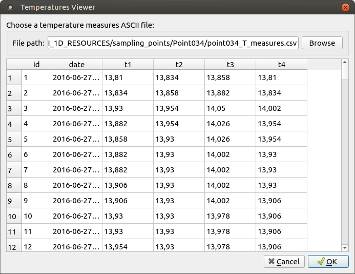

# Molonari_TP_IHM

## Objetif du TP
Apprendre à utiliser PyQt et QtSql pour fabriquer une Interface Homme-Machine permettant de visualiser le contenu d'une base SQL.

## Comment?
Fabriquer une petite IHM permettant de visualiser sous forme d'un tableau les mesures de température générées par les datalogger de Molonari (Hobo).
Idéalement, il faut être capable de charger / visualiser les trois fichiers fournis ici :
* https://github.com/agnes-riviere/MOLONARI_1D_RESOURCES/raw/main/sampling_points/Point034/point034_T_measures.csv
* https://github.com/agnes-riviere/MOLONARI_1D_RESOURCES/raw/main/sampling_points/Point046/point046_T_measures.csv
* https://github.com/agnes-riviere/MOLONARI_1D_RESOURCES/raw/main/sampling_points/Point047/point047_T_measures.csv

En utilisant QtDesigner et PyQt (IDE au choix), la fenêtre (QDialog) devra permettre de :
* Lire un fichier CSV de températures MOLONARI 1D et charger son contenu en mémoire (Pandas Dataframe)
* Enregistrer les données du Dataframe dans une base SQL (création d’une table SQL avec les colonnes date, t1, t2, t3 et t4)
* Relire la base SQL et charger son contenu en mémoire (QSqlTableModel)
* Visualiser les mesures sous la forme d’un tableau (QTableView)

## Instructions
1. Partir des scripts fournis : https://github.com/fabien-ors/Molonari_TP_IHM
2. Compléter et agencer l’UI avec QtDesigner (pour quelle ressemble à l'image ci-dessous)
3. Remplir les trous indiqués **# TODO** dans le script python
4. Me renvoyer vos scripts par mail

## Barème d'évaluation
Note /20:
* Chargement CSV fonctionnel : 5 pts 
* Chargement SQL (écriture/lecture) : 5 pts
* Visualisation de la table des mesures : 5 pts
* Qualité du code et robustesse : 5 pts

## Ressources utiles
Documentation C++ de Qt: https://doc.qt.io/qt-5/classes.html

Tutoriels bien pratiques:
* https://realpython.com/qt-designer-python
* https://realpython.com/python-pyqt-database

